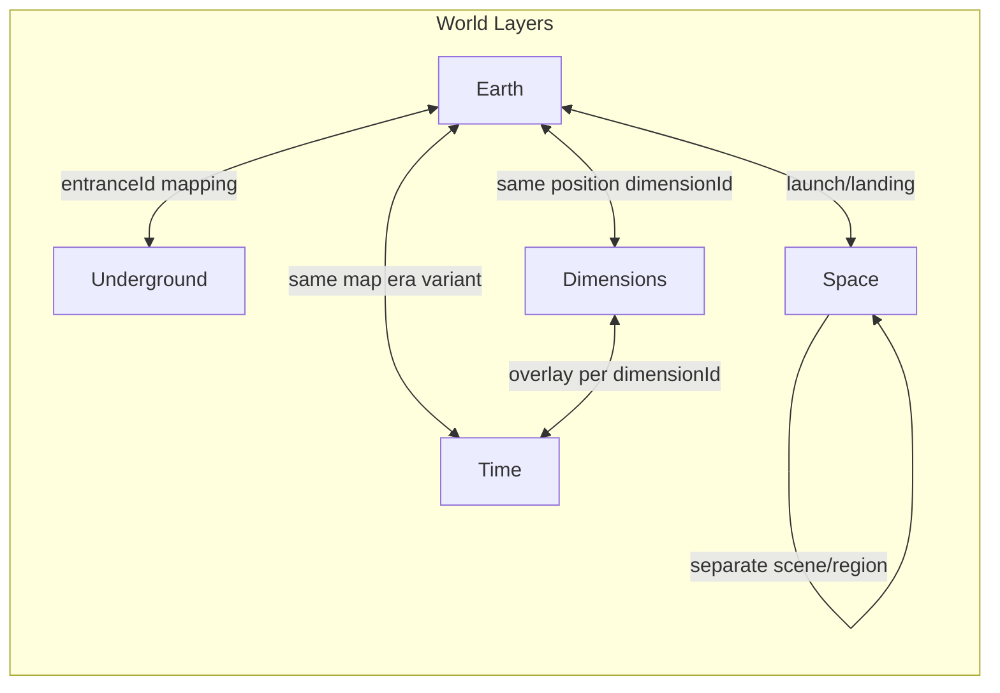

# Doraemon Epic Game — Full Design Document

A build-ready game design blueprint for a Doraemon-inspired epic adventure combining Earth exploration, space, mecha, time travel, underground civilizations, and alternate dimensions with emotionally driven storytelling.

**Platform:** Laptop (PC) · **Input:** Keyboard + mouse / controller · **Camera:** Third-person with cinematic framing

---

## Step 1 – Player Role & Core Fantasy

### Who the Player Is

The player is **Sora**, a child living in present-day Tokyo (Nerima ward, canon-compatible). Sora is the **great-grandchild of Nobita**. They are kind but often doubt themselves—echoing Nobita’s gentle nature without being a copy. Sora does not know their family’s full history with Doraemon until the inciting incident. This keeps the story canon-compatible: Doraemon’s mission to help Nobita’s line continues through the generations when the timeline is threatened.

### Why Doraemon Chooses to Help

A **timeline crisis** pulls Doraemon back from the future: reality is fracturing across time and dimensions, and the cause is tied to Nobita’s bloodline. Nobita’s descendant (Sora) carries a latent “temporal resonance” that can stabilize or worsen the collapse. The future cat robot is sent with a **inherited promise**: “When the sky cracks and the past calls, find Nobita’s heir.” Doraemon does not help out of duty alone—he grows to care for Sora as he did for Nobita, creating the emotional core.

### First 30–60 Minutes: Emotional Hook

- **Story beat:** Sora finds an old diary in the attic (Nobita’s), describing a “blue cat from the future” and a “door to anywhere.” The sky glitches—a brief visual tear. Doraemon crashes into the room, damaged and low on power, and says Sora’s name before shutting down. The player feels: *This is about me. Something from my family’s past has come for me.*
- **Gameplay beat:** The first 30 minutes are exploration and light interaction (house, neighborhood). When Doraemon wakes, the player receives the **Take-copter** and flies for the first time over Nerima. Control and wonder are paired: “I can go anywhere—and Doraemon is with me.”

**Narrative flags / save state set in this phase:** `met_doraemon`, `first_flight_complete`, `attic_diary_read`, `player_name` (if customizable). These gate later dialogue and trust mechanics.

### Player Fantasy (One Sentence)

*You are the kid who grows into the hero who saves time and space alongside Doraemon—not by being the strongest, but by being the one who never gives up on friends and never stops believing in tomorrow.*

---

## Step 2 – World Architecture (Build-Ready)

The world is designed as **layers** that share or override coordinates. Each layer has a type, ID, and rules for loading and connection.

### Earth Map Structure

- **Regions:** Continental chunks (e.g. Japan, Asia, Europe, Americas). Each region has an `id`, `bounds` (axis-aligned or polygon), and `connections` (adjacent region IDs or loading triggers).
- **Cities / landmarks:** Named locations inside regions (e.g. Tokyo, Nerima, specific parks or buildings). Stored as `Location { id, position, regionId, displayName, landmarkType }`.
- **Streaming / chunk logic (conceptual):** Only the current region plus a buffer (e.g. one adjacent region) are fully loaded. Crossing a region boundary triggers unload of the farthest region and load of the new one. Chunks within a region can be distance-based (e.g. load within radius of player). Key boundaries: region edges, entrance/exit triggers for underground and space.

### Underground Worlds

- **Link to surface:** Each underground zone has one or more **entrance IDs** tied to surface coordinates. Example: `UndergroundZone { zoneId, entranceIds: [EntranceId], surfacePositionMap: { entranceId -> worldPosition } }`. Entering at (x, y, z) on surface with `entranceId` loads the corresponding underground scene; exiting uses a paired exit that maps back to a surface position.
- **Structure:** Underground uses the same coordinate system as surface but in a separate **layer**; vertical offset or a separate scene can represent depth. No need for a full 1:1 world—only entrance/exit pairs and local underground geometry.

### Space

- **Orbits, planets, stations:** Treated as **named locations** with simple rules. `SpaceLocation { id, type: planet|station|orbit_zone, gravityParams?, orbitWaypoints? }`. Planets have `gravityParams` (magnitude, radius); orbit zones can be a list of waypoints the player or ship follows. Stations are fixed positions (or on rails).
- **Transit:** Movement between Earth and space is via **launch/landing** sequences or gadget (e.g. rocket from Doraemon). Loading: unload Earth region, load space “region” (e.g. solar system view or specific planet surface).

### Alternate Dimensions

- **Overlay of same coordinates:** A dimension is a **layer** that reuses the same (x, y, z) or (region, localPos). `Dimension { dimensionId, overlayOfLayerId, visualVariant, ruleSet }`. Same world position, different `dimensionId`—different art, NPCs, and state. Switching dimension = swapping which dimension’s content is active at current position; no need to move the player.
- **State:** Each dimension can have its own world state (e.g. “dimension_A_npc_states”, “dimension_B_quest_flags”). Shared state (e.g. player inventory) can be global or dimension-scoped by design.

### Time Travel

- **Past / present / future = same map, different era:** Time is an **era** axis. `TimeEra { eraId, label: past|present|future, mapVariantId }`. The same region/layout can have multiple variants (past = older buildings, future = sci-fi). `Location` extends to `(position, timeline, dimension)` so one coordinate can resolve to different content per (era, dimension).
- **Cause and effect:**  
  - **Shared across time:** Player inventory, key story items, “timeline-stable” flags.  
  - **Per-timeline:** NPC states, destructibles, side-quest progress in that era.  
  - **Rules:** Changing the past can set flags that the present/future reads (e.g. “planted_tree_in_past” → present has a big tree). Paradox rules: e.g. no killing critical ancestors; attempting forbidden actions triggers a “paradox warning” or temporary debuff instead of hard fail.

### Data Structures (Summary)

```text
WorldLayer { layerId, type: earth|underground|space|dimension|time }
Region { id, bounds, connections[], chunkConfig? }
Location { id, position, regionId?, layerId?, timeline?, dimensionId?, displayName, landmarkType? }
Entrance { entranceId, surfacePosition, targetZoneId, targetPosition }
UndergroundZone { zoneId, entranceIds[], surfacePositionMap }
SpaceLocation { id, type, gravityParams?, orbitWaypoints? }
Dimension { dimensionId, overlayOfLayerId, visualVariant, ruleSet }
TimeEra { eraId, label, mapVariantId }
```

### State Systems

- **Global state driving content:** `currentLayer`, `currentDimensionId`, `currentEra`, `currentRegionId`. These determine which assets and NPCs load.
- **Per playthrough saved:** Player position, inventory, gadget cooldowns, story flags, timeline-specific flags (per era), dimension-specific flags, mecha bond level, unlocked areas. Save format conceptually: `SaveData { globalFlags, perEraFlags, perDimensionFlags, playerState, worldState }`.

### World Layers Diagram



---

## Step 3 – Main Story Arc (Doraemon Movie Scale)

### Beginning: Discovery of Forbidden Technology

- **Inciting incident:** The sky glitches; Doraemon crashes into Sora’s life. He reveals that someone is **stealing “time fragments”** from critical moments across history to build a device that can rewrite reality. The thief is linked to a **lost 22nd-century project**: a giant robot meant to protect Earth, which was shut down and sealed away after an accident. That robot’s **core** is the key to the villain’s plan.
- **Discovery:** Sora and Doraemon find clues in the past (Nobita’s era) and present that point to the robot’s resting place—underground, then later in a dying dimension. The forbidden tech is the **robot’s heart**: a temporal battery that should never be weaponized.

### Middle: Escalation to Space and Cosmic Threat

- **Escalation:** The villain (see Step 4) has already taken the fight to **space**—hijacking stations and using time fragments to create “timeline bombs.” Sora and Doraemon must ally with rebels, scientists, and friendly aliens to secure resources and information.
- **Giant robot awakening and bonding:** The sealed robot is not destroyed—it is dormant. Sora’s temporal resonance (Nobita’s bloodline) is the only key that can wake it without corrupting it. The robot awakens and **bonds** to Sora; its power grows with their emotional connection (bond mechanic). The middle act culminates in a first major victory (e.g. saving a space colony) but at a cost: Doraemon’s battery is damaged, and the villain obtains one of the time fragments needed for their final plan.

### Emotional Conflicts (Doraemon and Player)

- Doraemon fears that Sora will be hurt or corrupted by the same technology that once endangered Nobita. He sometimes withholds gadgets or information “for Sora’s safety,” creating tension.
- Sora feels the weight of being “Nobita’s heir”—everyone expects something from them. They must choose, in key moments, between obedience to Doraemon and following their own judgment (e.g. using a risky gadget to save a friend). These choices feed into trust and hidden endings.

### Climax: Time, Sacrifice, Reality Collapse

- The villain activates the **reality-rewriting device**, causing timelines to **collapse** into one: a single, controlled reality where they rule. The world (and space) begins to visually and mechanically glitch; familiar places merge or vanish.
- **Sacrifice:** Stopping the device requires someone to enter the “core” and stabilize it from inside. Doraemon volunteers; his battery is already failing. Sora (and the robot) must hold off the villain and protect the entrance to the core while Doraemon works inside. Optionally, the player can choose to send the robot’s energy to Doraemon at a critical moment (choice: save Doraemon’s battery vs. keep robot at full power for the final boss).

### Ending: Bittersweet, Hopeful, Unforgettable

- The device is neutralized; the villain is defeated or contained. Doraemon survives but must return to the future for **repairs**—his body cannot stay in the present for long. He and Sora share a final promise: “When you need me again, I’ll find you.” The tone is bittersweet (goodbye) and hopeful (the bond is permanent; the future is open).
- **Unforgettable:** The last shot is Sora (and friends, if present) looking at the sky where Doraemon’s time machine vanished—the same sky that once cracked and brought them together.

### Side Quests

- **Gadget trials:** Short challenges that teach and stress-test gadgets (e.g. “Use only the Anywhere Door to reach five landmarks in under three minutes”).
- **Character episodes:** Nobita / Shizuka / Gian / Suneo (or new allies) have personal quests that deepen their relationship and unlock dialogue or small perks.
- **Lore:** Collectibles and NPC conversations that explain the 22nd-century project, the robot’s history, and the villain’s past. Optional and non-blocking.

### Optional Lore (Where It Lives and How It’s Unlocked)

- **Where:** Hidden in underground ruins, space station logs, and past-era documents. Some lore is behind optional areas unlocked by gadgets or mecha.
- **How:** Reading documents, listening to NPCs after certain story beats, and finding “memory orbs” (or similar) in the world. Unlocking lore can fill a codex and optionally influence dialogue in the finale.

### Hidden Endings (Tied to Player Choice)

- **True ending:** Requires high trust with Doraemon, high mecha bond, and having made the “sacrifice” choice (e.g. sharing robot energy with Doraemon). Doraemon leaves a small memento that allows a post-game “message” from him.
- **Rebel ending:** If the player repeatedly defied Doraemon and chose aggressive options, Sora is more independent but Doraemon’s farewell is sadder; the future is less certain.
- **Legacy ending:** If the player completed most Nobita-era side content and found the diary’s “hidden page,” an extra scene shows Nobita’s spirit (or message) acknowledging Sora—tying the lineage explicitly.

**Implementation (story beats and flags):** Major transitions gated by flags such as: `act1_complete`, `robot_awakened`, `doraemon_battery_damaged`, `villain_phase2`, `collapse_started`, `core_entered`, `device_neutralized`. Choice IDs: `final_sacrifice_choice`, `defiance_count`, `trust_level`, `mecha_bond_level`, `lore_collected_count`.

---

## Step 4 – Characters & Villains (Gameplay-Relevant)

### Doraemon

- **Gadgets:** Uses the gadget system (see Step 5): Take-copter, Anywhere Door, Time Machine (shared with story), Small Light, Copying Toast, Pass Loop, and others as unlocked. List is extensible via config.
- **Limitations:** Battery depletes with heavy gadget use; story moments can force low power (reduced gadget use or cooldowns). Moral limits: he will not give gadgets that could permanently harm others or break time in forbidden ways—enforced by narrative and by not offering certain actions.
- **Emotional role:** Mentor, friend, and sometimes the one who must be challenged. His fear for Sora and his loyalty to Nobita’s line drive both support and conflict. Gameplay: primary source of gadgets; companion in exploration; dialogue and trust affect story branches.

### Protagonist (Sora)

- **Growth mechanics:** Stats or tiers for stamina, gadget proficiency, and mecha sync. Unlocks: new movement options (double jump, dash) and gadget upgrades (faster cooldown, wider range) via story and side content. Progression is horizontal (tools) and vertical (bond, trust).
- **Narrative arc:** From uncertain child to someone who chooses courage and responsibility. Growth is shown through dialogue options and key story choices (e.g. standing up to the villain, forgiving an ally).

### Nobita / Shizuka / Gian / Suneo (If Included)

- **Nobita:** Appears in past-era segments as a young boy. Narrative: shows the origin of the promise and the robot project. Gameplay: can give past-era quests or hints; emotional anchor for “legacy” ending.
- **Shizuka:** Present or past. Narrative: kindness and moral compass. Gameplay: support companion in some sections; provides healing or buff items; optional side quests.
- **Gian:** Present or past. Narrative: loyalty and toughness. Gameplay: temporary companion for combat or “muscle” puzzles; optional brawl or minigame.
- **Suneo:** Present or past. Narrative: vanity and growth. Gameplay: information broker (tips, map markers); optional treasure-hunt side quests.

### Allies (Scientists, Rebels, Aliens)

- **Scientists:** Narrative: exposition on time tech and the robot. Gameplay: gadget upgrades, mecha parts, quest givers for “fix the device” objectives.
- **Rebels:** Narrative: resistance to the villain’s regime in space. Gameplay: safe houses, missions, pilot for space transit.
- **Friendly aliens:** Narrative: stakes beyond Earth. Gameplay: vendors, unique items, optional space regions.

Each ally has a **narrative purpose** (why they matter to the plot) and a **gameplay purpose** (vendor, pilot, mission control, quest giver).

### Villains

- **Primary antagonist:** A former keeper of the 22nd-century project who became obsessed with “fixing” the past by erasing all mistakes—including the accident that shut down the robot. Motivation: grief and a twisted sense of justice. Powers: time fragments (short rewinds, temporal shields), control of corrupted tech, and a personal mech in the finale.
- **Boss system:** Multi-phase. Phase 1: ground/ship combat, weak points on mech. Phase 2: time fragments create “ghost” copies or rewind attacks—player must use gadgets or mecha abilities to break the pattern. Phase 3: emotional beat (dialogue or choice) before final phase. Final phase: full mecha vs mech in collapsing space; bond level can unlock a finishing move or survival buffer.

### Character Summary Table

| Character    | Narrative purpose           | Gameplay purpose              | Emotional arc                    |
|-------------|-----------------------------|-------------------------------|----------------------------------|
| Doraemon    | Mentor, link to Nobita      | Gadget source, companion      | From protector to equal partner  |
| Sora        | Hero, Nobita’s heir         | Player avatar, growth         | From doubt to courage            |
| Nobita      | Legacy, promise origin      | Past-era quests / hints       | Passing the torch                |
| Shizuka     | Moral compass               | Support, items, side quests   | Kindness as strength             |
| Gian        | Loyalty                     | Combat help, minigames        | Tough exterior, soft heart       |
| Suneo       | Information, growth         | Tips, treasure quests         | From show-off to team player     |
| Scientists  | Tech exposition             | Upgrades, quest givers        | Hope through knowledge           |
| Rebels      | Resistance                  | Safe houses, missions, pilot  | Sacrifice for others             |
| Villain     | Thematic foil               | Boss phases, mechanics        | Tragedy behind the threat        |

---

## Step 5 – Core Gameplay Systems

### Exploration

- **Earth, space, underground, dimensions:** Movement is standard third-person (run, jump, climb where allowed). Discovery: points of interest (POIs) appear on the map when in range or when using a gadget (e.g. “Treasure Detector”). Each layer (earth, underground, space, dimension, time) uses the same core movement; differences are gravity (space), layout (underground), and visuals/state (dimension, time).
- **Traversal tools/gadgets:**  
  - **Take-copter:** Flight within region; limited altitude; cooldown or battery.  
  - **Anywhere Door:** Open door to a previously visited or unlocked location; limited uses per rest or cooldown.  
  - **Time Machine:** Story-gated travel between eras (past/present/future).  
  - **Pass Loop:** Pass through walls in designated spots (puzzle/traversal).  
  - **Bamboo Copter (upgrade):** Longer flight or faster speed.  
  Implementation: each gadget exposes “can use here” and “effect” (e.g. set destination, apply velocity).

### Gadgets (Doraemon Core)

- **Inventory logic:** Slots per category (traversal, combat, utility, story). Gadgets are acquired via story or side quests. Equipped set is limited (e.g. 4–6 active) to avoid overload; the rest are selectable from a wheel or menu.
- **Cooldowns / limitations:** Per-gadget: cooldown in seconds or “uses per day” (in-game time). Doraemon’s battery is a shared resource for the heaviest gadgets; when low, cooldowns increase or some gadgets are disabled until rest/recharge.
- **Creative problem-solving:** Gadgets interact with world: Small Light shrinks objects/enemies for puzzles or combat; Copying Toast duplicates keys or items for one-off puzzles; Pass Loop opens alternate paths. Design: each gadget has a “world interaction” list (e.g. shrinkable, passable, grabbable).
- **Key state (implementation):** `gadget_cooldowns: Map<GadgetId, Timestamp>`, `gadget_battery_percent`, `equipped_gadgets: GadgetId[]`, `unlocked_gadgets: Set<GadgetId>`.

### Mecha System

- **Entry/exit:** Player approaches robot and triggers “board” (contextual button); camera transitions into cockpit or third-person mecha view. Exit: hold button or use “disembark” at safe spot; robot can remain in world as NPC or despawn depending on design.
- **Combat, movement, upgrades:** Movement: run, jump, dash, hover (if applicable). Combat: melee combo, ranged shot, heavy attack, block/evade. Upgrades: found in world or from scientists—e.g. stronger beam, faster dash, armor. Represented as upgrade tree or linear unlocks.
- **Emotional bond mechanic:** Bond level increases through story beats and optional interactions (talking to the robot, using it in key moments). Effects: sync gauge fills faster; unlocks special moves or a “fusion” attack; in story, the robot may act on its own to save Sora once when bond is high.
- **Key state:** `mecha_bond_level`, `mecha_upgrades_unlocked: Set<UpgradeId>`, `mecha_current_hp`, `mecha_energy`, `is_inside_mecha: boolean`.

### Time Travel System

- **Timeline variables:** What can change: item states (e.g. key taken in past), NPC states (e.g. character saved in past), world state (e.g. tree planted, building repaired). Stored per era: `perEraState[eraId] = { npcStates, worldFlags, inventorySnapshot? }`.
- **Player choices:** Decisions (e.g. “give the item to A or B”) are recorded as `choiceId -> value` and can be read by story scripts. Major choices gate endings; minor choices affect dialogue or side outcomes.
- **Consequences and paradox rules:** Allowed: planting seeds, giving non-critical items, talking to ancestors. Forbidden: killing or seriously harming timeline-critical NPCs. Attempting forbidden action: show warning; if player persists, apply “paradox” (e.g. temporary debuff, screen effect, or forced rewind). No permanent timeline corruption in first run—keep rules clear.
- **Inputs (implementation):** Time travel trigger: `from_location, to_era, choice_id?`. System updates `currentEra`, saves per-era state when leaving, loads per-era state when entering.

### Progression

- **Skills:** Unlocked via story or collectibles: double jump, dash, wall cling, better stamina. Stored as `unlocked_skills: Set<SkillId>`.
- **Gadgets:** Unlock order is story-driven (Take-copter first, then Anywhere Door, etc.) with optional gadgets from side quests. Conditions in config: `Gadget { id, unlockCondition: story_flag | quest_id }`.
- **Story-based unlocks:** Gates: e.g. “after Act 2, space opens” (flag `space_accessible`); “after robot awakening, mecha available” (flag `mecha_unlocked`). Progression table: story_beat -> flags_set -> content_unlocked.

---

## Step 6 – Emotional Design & Themes

### Gameplay to Emotions

1. **Doraemon’s battery running out:** Fear of losing your friend; the player learns to manage resources and avoid overreliance on gadgets—reinforces dependence and care.
2. **Mecha bond level:** Pride and attachment; the robot feels like a partner, not a tool. Investing in bond rewards the player with power and story payoffs.
3. **Time travel choices:** Responsibility; changing the past has visible consequences in the present (e.g. a character who was saved is now alive). The player feels the weight of choice.
4. **First flight (Take-copter):** Wonder and freedom; the world opens up and the tone is hopeful.
5. **Paradox warning / near-failure:** Tension and relief; the player brushes against disaster and is reminded that actions matter.

### Story Moments to Responsibility

- Choosing whether to use a risky gadget to save someone (Doraemon says no; player can obey or defy).
- The final sacrifice choice (give robot energy to Doraemon or keep it for the fight)—player decides who is “saved” first.
- Past-era decisions that visibly change the present (e.g. helping a young character shapes their future dialogue).

### Themes with Concrete Examples

- **Friendship:** Doraemon and Sora’s trust meter and dialogue; the mecha bond. Example: robot shielding Sora in a cutscene when bond is high.
- **Courage:** Sora standing up to the villain in dialogue; optional “courage” choices in side quests (e.g. defending a weak character). Example: a moment where Sora must speak up alone.
- **Responsibility of technology:** The villain is a cautionary tale; the robot was sealed because it was misused. Example: a log or flashback showing the original accident.
- **Loss and growth:** Doraemon’s eventual farewell; optional loss of a minor ally. Example: a side character who sacrifices themselves in one branch.
- **Childhood wonder vs maturity:** Early game = wonder (flight, first time travel). Late game = harder choices and sacrifice. Example: the same sky that was “magical” at the start is now the place where Doraemon leaves.

---

## Step 7 – Signature Playable Movie Moments

1. **First space launch with Doraemon**  
   **Cinematic:** Rocket rises from Earth; Doraemon and Sora in the cabin; the planet shrinks below.  
   **Interactive:** Player holds throttle or follows a simple QTE; can look around the cabin.  
   **Mechanical:** Unlocks space layer; first time `currentLayer = space`.

2. **First timeline collapse**  
   **Cinematic:** The world flickers; buildings merge or vanish; the sky cracks.  
   **Interactive:** Player must run or fly to a safe point while the environment shifts; possible short platforming.  
   **Mechanical:** Introduces collapse state; may temporarily restrict time travel or gadgets.

3. **Robot transformation (awakening)**  
   **Cinematic:** The sealed robot activates; bond is established in a flash of light; first cockpit view.  
   **Interactive:** Player triggers “sync” or a short sequence (e.g. button prompts); then first mecha control.  
   **Mechanical:** Unlocks mecha; sets `mecha_bond_level` to initial value; mecha system becomes available.

4. **Doraemon’s emotional breaking point**  
   **Cinematic:** Doraemon, low on battery and afraid for Sora, finally admits he doesn’t want to lose another friend.  
   **Interactive:** Dialogue choice: reassure him, or push forward despite his fear. Choice affects trust.  
   **Mechanical:** Trust flag; possible temporary restriction or boost depending on choice.

5. **Final goodbye or promise**  
   **Cinematic:** Doraemon boards the time machine; Sora and friends watch; last exchange of promise.  
   **Interactive:** Player chooses final dialogue line (hope, gratitude, or humor); optional “wave” or gesture.  
   **Mechanical:** Triggers ending branch; saves “final_choice” for post-credits or True ending.

6. **First dimension tear**  
   **Cinematic:** Reality splits; the same location appears in two versions (e.g. normal vs twisted).  
   **Interactive:** Player walks through the tear (or uses a gadget); dimension id switches.  
   **Mechanical:** First use of dimension layer; tutorial for dimension switching.

7. **First villain confrontation (mid-game)**  
   **Cinematic:** Villain appears with time fragments; taunts Sora and Doraemon; short boss or escape.  
   **Interactive:** Combat or chase; player must use recently learned gadget or mecha ability to survive.  
   **Mechanical:** Introduces villain mechanics; sets “villain_phase2” or similar for story.

---

## What Makes This Game Legendary and Timeless

**Define Doraemon for a new generation:** The game takes the core promise of Doraemon—a friend from the future who helps you face the impossible—and scales it to a full epic: Earth, space, time, and dimensions. It keeps the warmth and humor of the IP while offering stakes and scope that feel like a tent-pole movie. New players get a complete, emotional story; longtime fans get deeper lore and the satisfaction of seeing Nobita’s legacy continue.

**Remembered emotionally, not just mechanically:** Players will remember the moment Doraemon said their name, the first time they flew over Tokyo, the robot waking up for them, and the sky when Doraemon left. The systems (gadgets, mecha, time travel) serve those moments. The game is designed so that the feeling of “I did this with Doraemon” and “I grew up a little” outlasts the memory of any single puzzle or boss.

**Both a game and a Doraemon movie you play:** The structure is cinematic (acts, climax, sacrifice, goodbye) but the player drives the pace and the choices. Side quests and exploration add playtime without diluting the main arc. Hidden endings reward engagement and reflection. In the end, it plays like a long, interactive Doraemon film—one where you are the hero and Doraemon is your partner until the very last frame.

---

*End of design document. See [IMPLEMENTATION_ROADMAP.md](IMPLEMENTATION_ROADMAP.md) for phased development tasks.*
